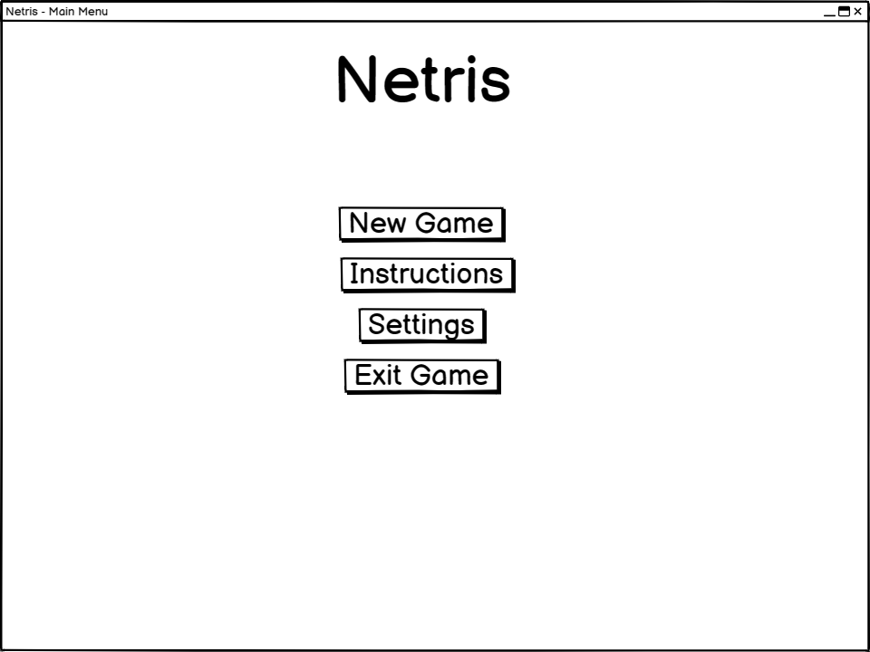
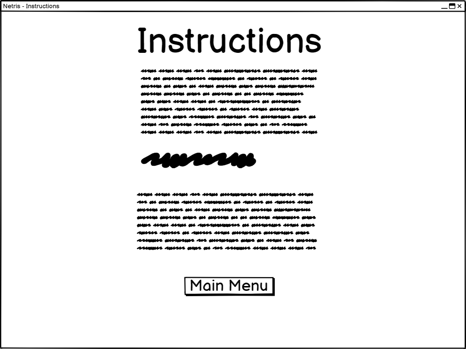
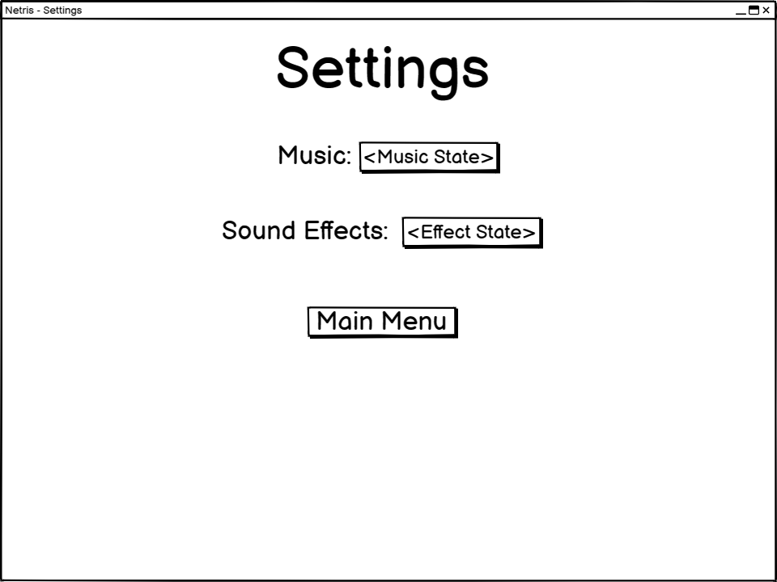
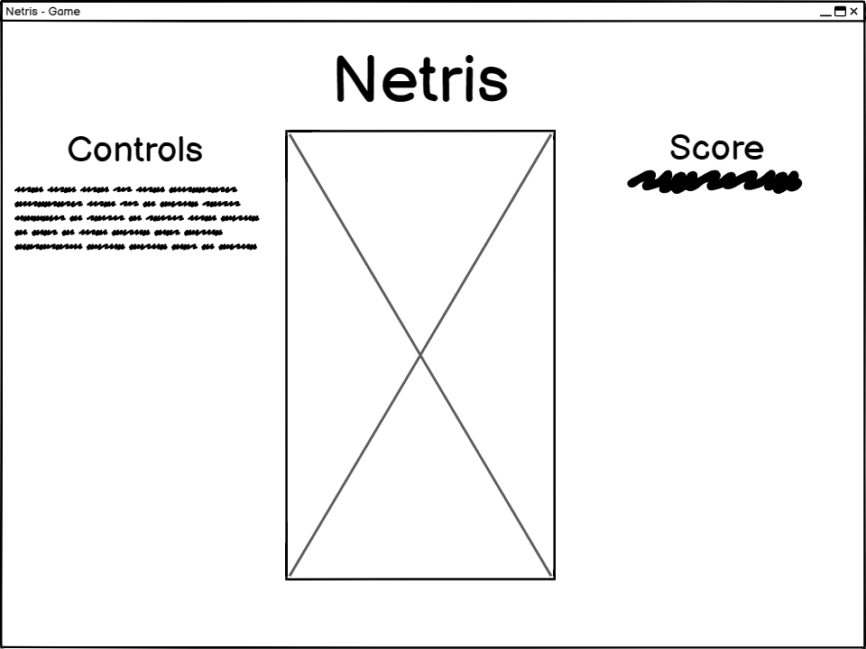
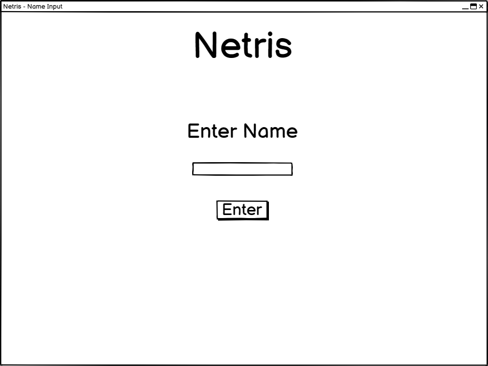
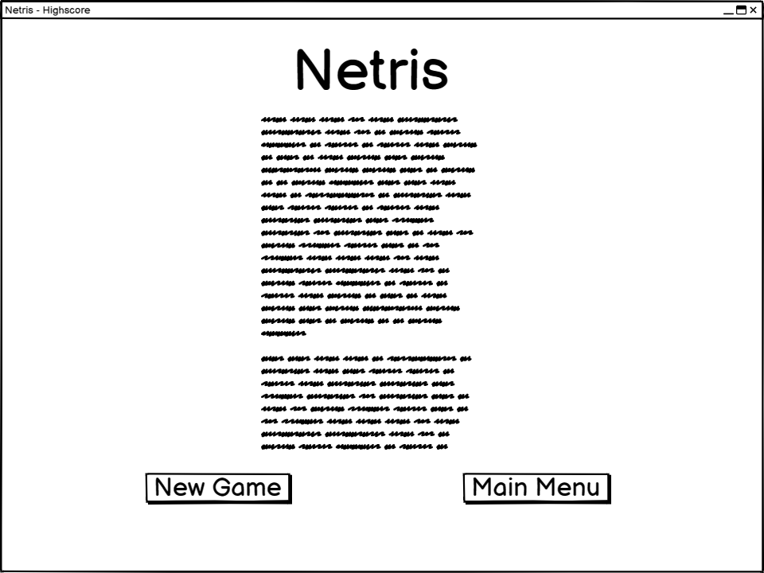
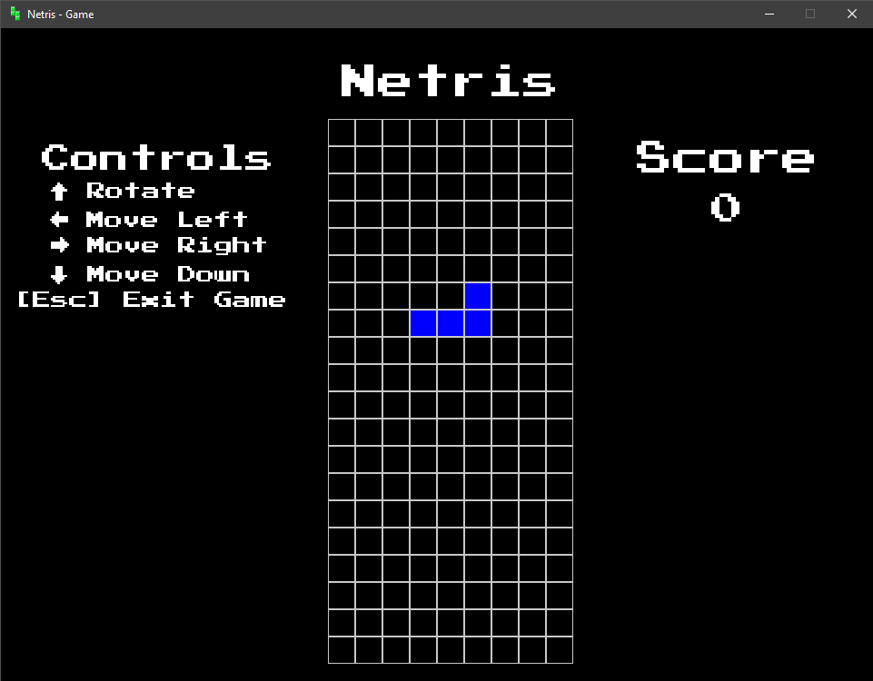
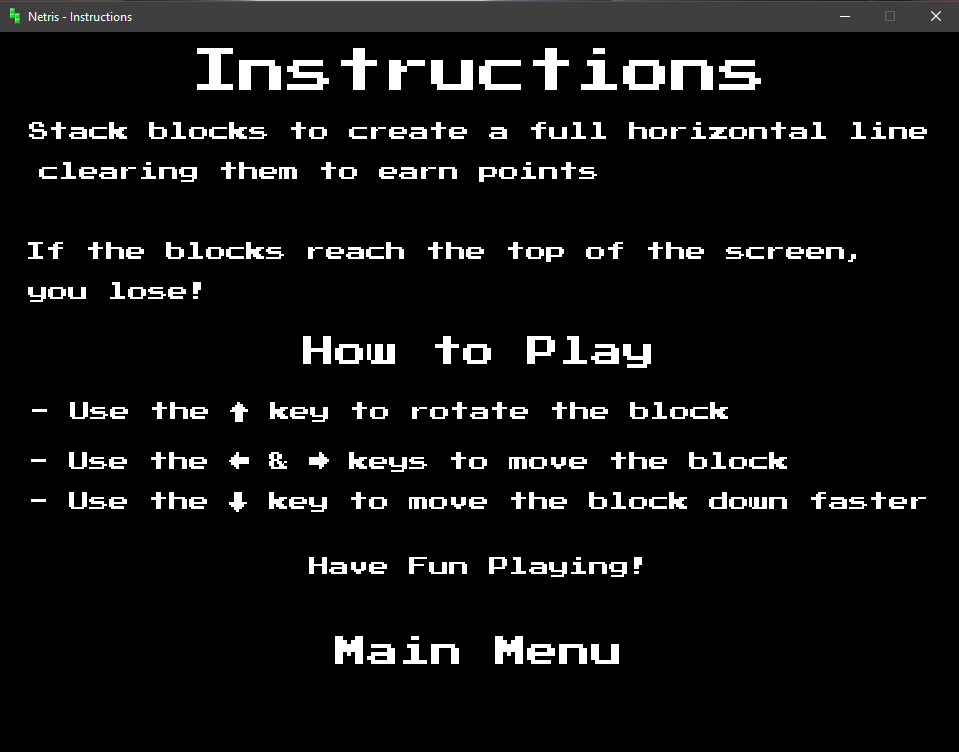
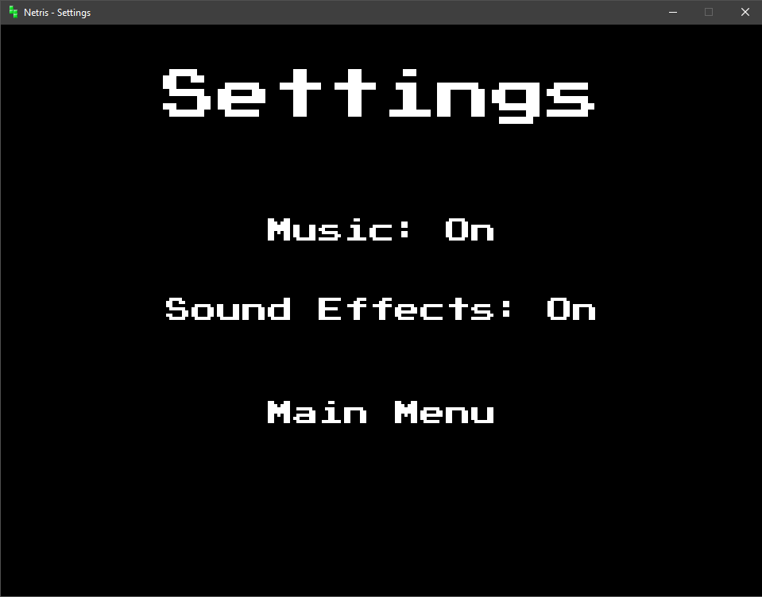
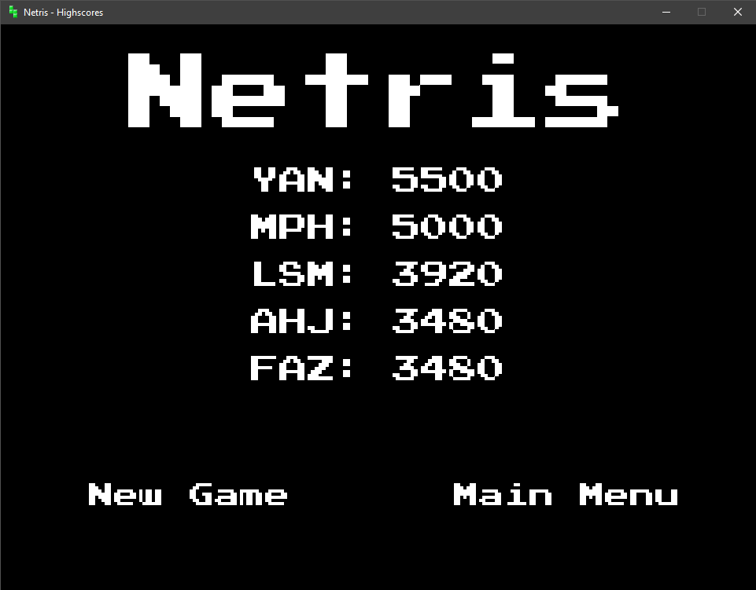

# 'Tetris'-Like game AH Computer Science Project

## Table

| Section        | Link                    |
| :------------: | :---------------------: |
| Pre-analysis   | [Link](#description)    |
| Analysis       | [Link](#analysis)       |
| Design         | [Link](#design)         |
| Implementation | [Link](#implementation) |
| Testing        | [Link](#testing)        |
| Evaluation     | [Link]                  |

## Description

This project will be a game called Netris. This game is about stacking blocks to create a full horizontal line and get points, the game gets harder as you continue as the blocks start moving faster towards the bottom of the window, giving you less time to make a decision on how to rotate and place the block. You lose when the blocks make it to the top of the screen and there's no more space. This game will be modelled to be similar to the original depiction of Tetris but some things may be altered to avoid copyright infringement

## Target Audience

- Main Age & Gender Range: 5+ & all genders
- Target Interests: Games/Retro Games
- Other:
  - You must own a computer to play this game
  - You must be semi proficient with computers in order to install python and its required libraries due to the game being programmed in the language.

## Requirements

- Input Validation:
  - The player can use the up key to rotate blocks, the left & right key to move the blocks left & right respectively
  - The scoreboard will only allow alphabetical characters, the enter & backspace key & a maximum of 3 characters should be inputted
  - Mouse input is required for the menus, of which the left click button is only validated
  - Files will be available for the program to take as parameters and modify the values, the values should also be validated

- Reading & Modifying Stored Data:
  - This program will only use the top 5 scores in a text file to make up a scoreboard, however many values will be stored. A text file will also be used to store the state of settings in the form of booleans

- Sorting Algorithm
  - A standard algorithm (in this case Bubble Sort) will be used to sort the highscores before they are written to a file

- An array of Objects
  - An array of objects will be used to store the score data & the GUI elements whilst the data is being manipulated using code

## Research

- Technical Study
  - This game is required to be object oriented to cut down on implementation time & to meet some requirements set by the SQA. The Python programming language is used for this purpose due to it already being object oriented, easy to obtain & install, implementation time will also be reduced to my proficiency with the language as well

  - This game will require a GUI, for this I have chosen to use the Python library Pygame. This requires Pip (Python Packaging Installer). This is feasible due to Pip coming with any stable release of Python & installing Pygame is easy due to it being a one line command in the terminal

  - In order to fulfil one of the requirements the SQA has given, I will be using pyodbc for my SQL query to a database. This is feasible due to the installation only taking a one line command in terminal

  - I will require documentation for how to use the Pygame library efficiently. This is feasible due to many websites detailing the many classes and methods that are provided with Pygame. The documentation with which I will be referencing will be in the Pygame website

- Economic Study
  - This project has no costs attached to development. All the software used is free & the purchase of hardware is not required, a license is also not required in the creation of this project

- Legal Study
  - Data Protection
    - Data Being Collected
      - Highscores
      - Player Names (3 Characters Maximum)

  - Copyright
    - The copyright for the original depiction of this game is held by the Tetris Company, this could be a problem. I will need to use resources that are publicly available in order to prevent copyright infringement

    - But due to this project not being a commercial product, this is not applicable to myself as there is no monetary gain involved, however, I will still follow these guidelines to the best of my ability

  - Schedule
    - This project is complex enough to be created within the time frame allowed, including holidays & unforeseen events such as illness

## Survey: [data.json](Analysis/Tetris%20End-User%20Survey.json)

## Analysis

### Video Games

- Knowledge of Tetris
  - 100% of the respondents knew about Tetris & how to play it

- Playing Video Games
  - ~93% of the respondents play videogames often whilst the other ~7% do not. There was no discernable difference between the respondents gender & how much they played video games, however, since the majority of respondents were male, this tips the scales slightly with only one female respondent who does not play videogames often

In conclusion, since the majority of respondents were male the target audience will be male, however, this does not exclude any other gender from the end user group due to the minor difference in who did & didn't play video games often

### Game Features

- Highscore Table Expected
  - All respondents expect Tetris to have a highscore table therefore one will be implemented

- High score Table
  - ~53% of the respondents wanted 10 scores to be displayed on the high score board with ~20% wanting 5 and the rest of the respondents picking another number

- Background Music
  - ~93% of respondents expected Tetris to have background music, therefore I shall add some background music
to the game that is copyright free
- Age Range
  - The majority of respondents felt that most ages would fit Tetris, therefore the target age range will be 5+.

In conclusion, all respondents expected a high score table for Tetris so one will be implemented with a maximum number of scores being 10 since that was the majority voted upon. I will also add background music because the majority of respondents expected there to be some sort of music, this will be within the public domain to make sure that there is no copyright infringement.

### End User Device Ownership

- Devices Owned
  - The majority of respondents owned between 2 - 5 devices

- Primary Device
  - The majority of respondents mainly use their phones with the 2nd most common device being a PC or laptop

- What device would you play this on
  - The majority of respondents would play this game on their phone, however, due to time constraints I will be making this game for Windows PC exclusively because that is the easiest platform to develop for within the time constraints of this project.

In conclusion, most respondents own between 2 - 5 devices to multi
platform support would be beneficial, however due to time limitations I
will not be able to support more than 1 platform (Windows PC) because
that would require me learning many, platform specific, languages that I
do not have the time to do.

## UML Case Diagram


## Requirements Specification

- End Users
  - The end users will be any age who enjoy playing video games
  - Users must have basic knowledge of how to use a computer & they must own a UK qwerty keyboard.

- End User Requirements
  - The user must be able to play the game without the window lagging or stuttering during gameplay
  - The user must be able to play the game easily, meaning the game must be easy enough to keep up with

- Functional Requirements
  - There must be rules/instructions page to help the user understand how to play the gamer if they don’t know
  - The user must own a modern windows computer in order to play this game
  - The user must have a keyboard, mouse and some kind of screen in order to interact with the game and see the game window
  - The user must have python, pygame and pyodbc installed to run this game properly

## Project Plan


### Resources

- Pen/Pencil & Paper for design Prototyping
- SQA Project Specification & Any other appropriate SQA documents
- Computer with Mouse, Monitor & Keyboard
- Computer Software
  - [Gantt Project (Gantt Chart Creation)](https://www.ganttproject.biz/)
  - [SSMS (Microsoft SQL Server Management Studio)](https://learn.microsoft.com/en-us/sql/ssms/download-sql-server-management-studio-ssms?view=sql-server-ver16#download-ssms) (Optional)
  - [Microsoft SQL Server](https://www.microsoft.com/en-GB/sql-server/sql-server-downloads)
  - [VS Code (Implementation IDE)](https://code.visualstudio.com/)
  - Python & Libraries (Pygame, Pyodbc, Pip)
  - [Github (For File Hosting during Development & Timeline of Files & Modification)](https://github.com/)
  - Sufficient Storage Space
  - [Balsamiq (For design of UI)](https://balsamiq.com/)

## Design

### UI Wireframes

#### Home



#### Instructions



#### Settings



#### Game



#### Name Input



#### Highscore



### Pseudocode

#### Standard Algorithm

<https://github.com/TurtleHelm/AHC-Project/blob/a00d7f7df66ce7840d2014b9beaa2dbf96556459/Write%20Up/Design/Pseudocode%20(Extended).txt#L482-L494>

#### Array of Objects

<https://github.com/TurtleHelm/AHC-Project/blob/a00d7f7df66ce7840d2014b9beaa2dbf96556459/Write%20Up/Design/Pseudocode%20(Extended).txt#L651-L664>

(NOTE: More than one array of objects were used within this project, to view every one of them see [Appendix B: Design](https://github.com/TurtleHelm/AHC-Project/tree/main/Write%20Up/Design))

---

### Database Design & Development

#### Open/Close Database Connection to Execute SQL Query

<https://github.com/TurtleHelm/AHC-Project/blob/a00d7f7df66ce7840d2014b9beaa2dbf96556459/Write%20Up/Design/Pseudocode%20(Extended).txt#L536-L571>

#### Data Dictionary

| Field Name | Constrain   | Data Type | Field Size | Description    |
| :--------: | :---------: | :-------: | :--------: | :------------: |
| id         | Primary Key | Integer   | N/A        | Auto Generated |
| name       | Not Null    | String    | 3          | Users Name     |
| score      | Not Null    | Integer   | N/A        | Users Score    |

#### Structure of Table

```sql
CREATE TABLE highscore {
    id int NOT NULL AUTO_INCREMENT,
    name varchar(3) NOT NULL,
    score int NOT NULL,
    PRIMARY KEY (id)
};
```

---

## Implementation

### UI Design

#### Main Menu


#### Game



#### Instructions



#### Settings



#### Score Input


#### Highscores



### Code

#### Standard Algorithm

<https://github.com/TurtleHelm/AHC-Project/blob/a00d7f7df66ce7840d2014b9beaa2dbf96556459/Implementation/src/classes.py#L626-L644>

#### Array of Objects

<https://github.com/TurtleHelm/AHC-Project/blob/a00d7f7df66ce7840d2014b9beaa2dbf96556459/Implementation/src/instructions.py#L10-L21>

(NOTE: All code can be found in [Appendix C: Implementation](https://github.com/TurtleHelm/AHC-Project/tree/main/Implementation))

## Testing

### Test Plan

#### Home Page

No Normal, Exceptional or Extreme data for this page (due to mouse input only)

UI:

- Cursor Visible
- Black Background Colour
- White Text Colour
- UI in correct positions
- Correct Text Usage (e.g title is the right text)
- Correct font & font size used

Usability:

- Ease of Use & Ease of Understanding
- Functionality made clear for each UI object
- Readability

Functionality

- Do buttons redirect using their functions correctly
- Do buttons turn red on hover
- Do buttons play a sound when hovered & clicked if the settings are set
- Does the escape key quit the program

#### New Game Page

Normal Input: Up, Down, Left, Right Arrows, Escape, score file
Exceptional Input: Multiple combinations of Arrow Keys, empty score file
Extreme Input: Alphanumeric keys, no score file

UI:

- Cursor Invisible
- White Text Colour
- Black Background
- Grid in correct position & size
- UI in correct positions, sizes & font
- Display updatable score on right side of screen
- Display controls on left side of screen
- Draw blocks at top of screen with correct colour & orientation

Usability:

- Ease of Use & Ease of Understanding
- Readability

Functionality:

- If music setting is True then play background music on repeat
- If sound effect setting is True then play sound effects
- If Up arrow pressed rotate block
- If left or right allow is pressed move block
- If down arrow is pressed move block down
- Don’t move or rotate block if at grid boundary positions
- If block reached grid base then stop moving, add to score then add block to group then draw new block
- If block collides with block in group stop moving block, add to score then draw new block
- If block group reaches top of grid redirect to name input page
- If blocks fill entire row, add to score then remove row of blocks and move group down

#### Instructions Page

No Normal, Exceptional or Extreme data for this page (due to mouse input only)

UI:

- Cursor Visible
- Black Background Colour
- White Text Colour
- UI in correct positions with correct size & colours

Usability:

- Ease of Use & ease of Understanding
- Readability

Functionality:

- Do buttons turn red on hover
- Do buttons redirect using their functions correctly
- Do buttons play a sound when hovered & clicked if the settings are set

#### Settings Page

Normal Input: settings file
Exceptional Input: empty settings file
Extreme Input: no settings file

UI:

- Cursor Visible
- Black Background Colour
- White Text Colour
- UI in correct positions with correct size & colours

(Still to Complete)

---

## References

### Array of Tuples Idea: [PythonAssets](https://pythonassets.com/posts/tetris-with-pygame/)

### Pygame Docs: [Pygame](https://www.pygame.org/docs/)

### W3 Schools Docs [W3 Schools](https://www.w3schools.com/python)

### Yannik Nelson Space Invaders AH Project [Github](https://github.com/yanniknelson/AH-Computing-Project)

### Cosmobobak Battleship AH Project [Github](https://github.com/cosmobobak/AH-project-battleship)

### Pyodbc Docs: [Github](https://github.com/mkleehammer/pyodbc/wiki/Getting-started)

### ASCII Table: [ASCII-Code](https://www.ascii-code.com/)
